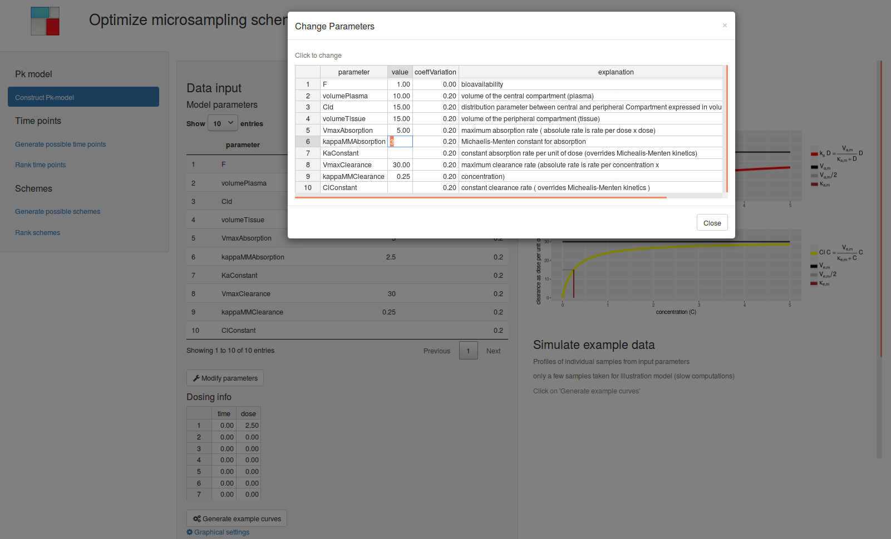
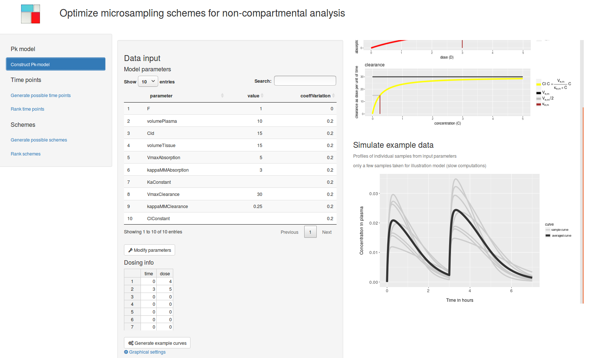
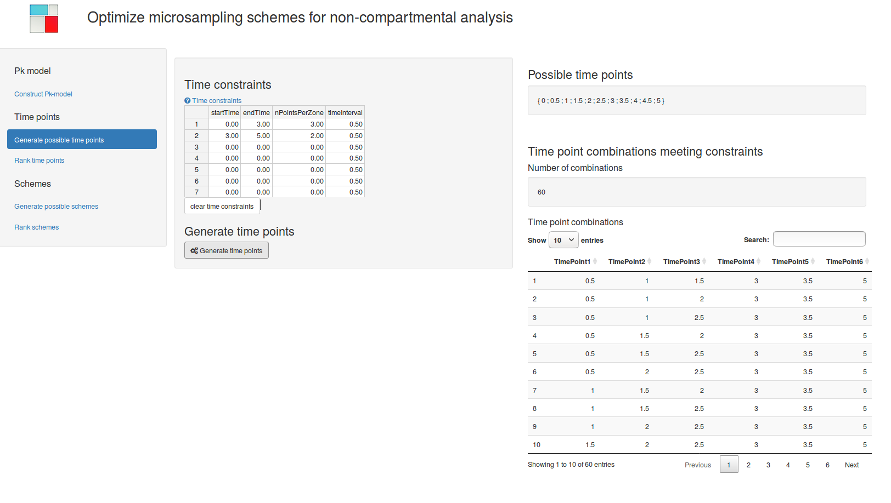
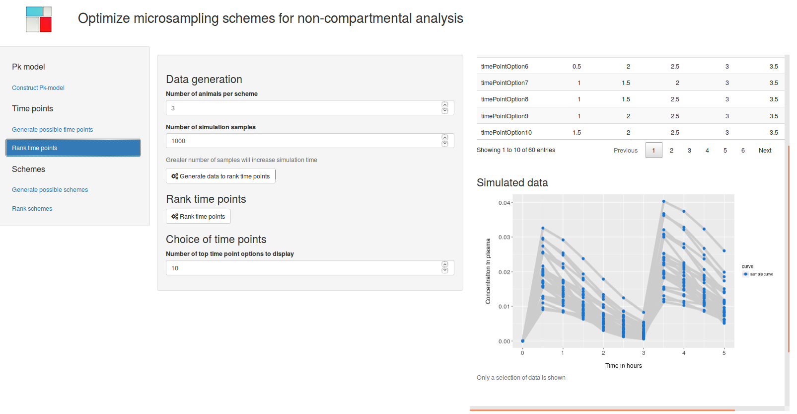
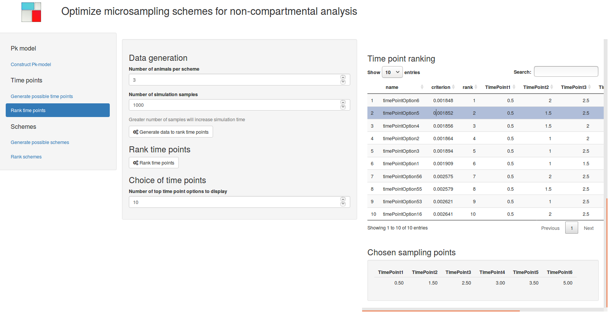
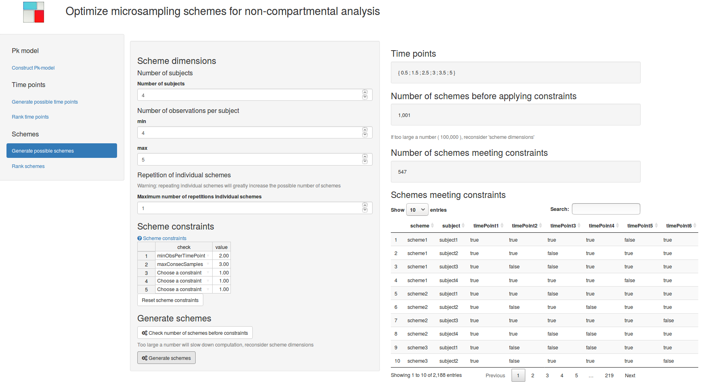
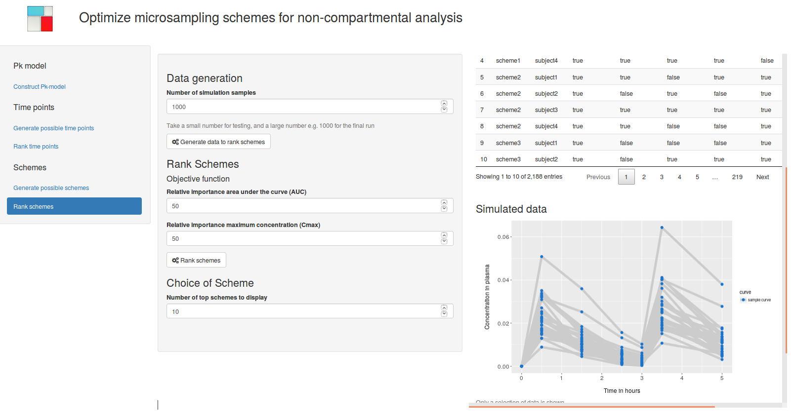
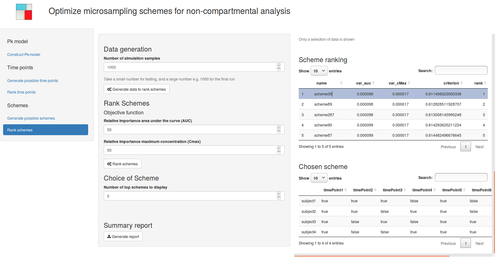

```{r setup, include = FALSE}
knitr::opts_chunk$set(
  collapse = TRUE,
  comment = "#>"
)
```

 \clearpage{}
 
```{r}
knitr::opts_chunk$set(fig.width=12 )
```
 
# Introduction

Microsampling, a novel blood sampling technique allows multiple blood samples
  to be taken per animal, reducing the number of animals required for
pharmacokinetic-pharmacodynamic studies (@chapman2014overcoming). Using sparce
designs can in addition, avoid unnecessary sampling of these animals, provided
an appropriate choice of sample times per animals is made. The microsamplingDesign package
implements a general simulation methodology to find optimal sparse microsampling
schemes aimed at non-compartmental pharmacokinetic analysis (algorithm III in
@barnettOD). This methodology consist of (1) specifying a pharmacokinetic model
including variability among animals; (2) generating possible sampling times; (3)
evaluating performance of each time point choice on simulated data; (4)
generating possible schemes given a time point choice and additional constraints
and finally (5) evaluating scheme perfomance on simulated data. The default
settings differ from (@barnettOD)) in the default pharmacokinetic model used and
the parameterization of variability among animals (see next section). A shiny
web application is included, which guides users from model parametrization to
optimal microsampling scheme.

 
# Model details 
  

A two compartmental oral dosing pharamcokinetic model
(@gabrielsson2001pharmacokinetic) is assumed: 

$$ \frac{d D_g}{dt} = - k_a.D_g $$
$$ V_c \frac{dC}{dt} = F.k_a .D_g  - Cl.C  - Cl_d.C + Cl_d.C_t $$
$$ V_t \frac{dC_t}{dt} =  Cl_d.C - Cl_d.C_t $$


A dose of a substance ($D_g$) is administered to the gut, than graduadely
absorbed into a central compartment leading to a increased concentration in the
plasma  ($C$). Where it can either be excreted or exchanged with a 
second  peripheral compartment, the peripheral tissues, where the compound has a
distinct concentration ( $C_t$) in time, depending on the rate of exchange with
the central compartment. We do not assume any excretion from the peripheral
compartment. 

Substance absorption and clearance are by default assumed to be 
capacity dependent  (Michaelis-Menten kinetics):

$$k_a = \frac{V_{a,max} }{ \kappa _{a,m}  + D_g }$$ 
$$Cl = \frac{V_{e,max} }{ \kappa _{e,m}  + C }$$

We also leave the option open for one or both of these parameters to be
constant.

For details see (@gabrielsson2001pharmacokinetic).


## Parametrization

*  $k_a$ is the absorption rate per unit of dose.
*  $V_c$ is the volume of the central compartment (plasma)
*  $V_t$ is the volume of the peripheral compartment (tissue)
*  $F$ bioavailability, the fraction of the dose that reaches the systemic 
    circulation intact (dimensionless)
*  $Cl$ is the elimination rate from the central compartment (assumed the only
   spot where elimination occurs); in volume per time, related to the
elimination rate in dose: ( $k_e = \frac{Cl}{V_c}$ )
*  $Cl_d$ is the distribution parameter between central and peripheral
   compartment; expressed in volume per time unit. It related to rates:
$Cl_d = \frac{k_{ct}}{V_c} =\frac{k_{tc}}{V_t}$; with $k_{ct}$ the rate from
   central to tissue (dose per time unit) , and $k_{tc}$ the rate from tissue to
   central compartment. 
*  $V_{a,max}$ is the maximum absorption rate ( absolute rate is rate per dose x
   dose)
*  $\kappa _{a,m}$ is the Michaelis-Menten constant for absorption 
*  $V_{e,max}$ is the maximum clearance rate (absolute rate is rate per
   concentration x concentration)
*  $\kappa _{e,m}$ is the Michaelis-Menten constant for clearance.

## Log-normal parameters

Individual animals are assumed to have the same underlying model, with different
parameters simulated from an underlying log-normal distribution parametrized in
terms of the mean and the coefficient of variation.

we assume a random variable $X$ to be log-normally distributed
with parameters $\mu$ and $\sigma$:

$$X = \exp{ \big( \mu + \sigma Z \big) }$$ with $Z$ a standard normal variable. 

Now, we want to extract $\mu$ and  $\sigma$ from and coefficient of variation
($CV = sd(X)/E(X)$) of the original scale.

we can use the relation for the mean:

$$E(X) = \exp{  \big( \mu + \frac{\sigma^2}{2} }  \big) $$

and the relation for the coefficient of variation:
$$CV(X) = \sqrt{ \exp{\sigma^2} - 1 }$$  


Therefore: $$\sigma = \sqrt{ ln( CV^2 + 1) }$$  


and $$\mu = \ln \big( E(X) \big) - \frac{\sigma^2}{2} $$


For the multivariate log-normal distribution, we use a the same approach per
variable and can simulate a random vector:
 $$\boldsymbol{X} =  \exp{ \big( \boldsymbol{\mu} + Z  \boldsymbol{\sigma^T} \big) }$$ 
 
 with $Z \sim \mathcal{N} ( \boldsymbol{0} , \Sigma )$ and  $\Sigma$ a specified
correlation matrix. More information see (@halliwell2015lognormal)

\pagebreak{}

# microsamplingDesign shiny application

Before diving into the R code of the microsamplingDesign package, we give a more intuitive
introduction to the methodology using the included shiny application. In a local
R session we can start the application:

```{r, echo = TRUE, message = FALSE, eval = FALSE}
library( microsamplingDesign )
runMicrosamplingDesignApp( installDependencies = TRUE )
```

The first time you want to run the application, use *installDependencies
= TRUE* to automatically install the additional R-package required for this
shiny application in addition to the microsamplingDesign package dependencies.

## Construct a pharmacokinetic model

Start the application by constructing a pharacokinetic model.

 
 ```{r constructModel, echo = FALSE , fig.cap  = "Construct a PK model" , out.width = "500px" , fig.align = "center" }

```
 
Example parameters are shown on start up. To modify these parameters click on
**Modify parameters** and a spreadsheet is displayed allowing modifying
parameter values and their coefficient of variation (see Figure
\@ref(fig:constructModel)).

Next include dosing information by filling out one or several lines, click on
**Generate example curves** to check simulated time-concentration curves (see
Figure \@ref(fig:sampleCurves)).

```{r sampleCurves, echo = FALSE , fig.cap  = "Check model by generating example curves" , out.width = "500px" , fig.align = "center" }

```

One can adapt the scale of the graphs by clicking on **Graphical settings**.

Note that the pharmacokinetic model in the application does not contain any
measurement error.


## Generate possible time points

Time point options are generated from a time constraints table specifying the
number of time points per time zone and minimum sampling interval in each row.
Note that the endTime is not included in the zone itself but is the startTime of
the next zone. 

```{r generateTime, echo = FALSE , fig.cap  = "Generate time points",out.width = "500px" , fig.align = "center" }

```

Finally click on the button **Generate time points**, to recieve all possible
combinations in table form (see Figure \@ref(fig:generateTime)). 


## Rank time points

Time points options are ranked by measuring the difference between approximating
the average time-concentration curve based on a limited number of time points on
sample data and the actual average curve at the maximal number of time points
you want to consider. This is a measure of bias caused by choosing a certain
time point option rather then sampling at the maximum number of time points.

In the application ranking time points takes 2 steps: 

### Generate sample data

```{r rankTime1, echo = FALSE , fig.cap  = "Generate data to rank time points", out.width = "500px", fig.align = "center" }

```

Specify the approximate number of animals you would like to use in you scheme
and the number of simulated datasets to generate. Then press **Generate data to
rank time points**. A selection of simulated data will be displayed (see Figure
\@ref(fig:rankTime1)).


### Rank time points

```{r rankTime2, echo = FALSE , fig.cap  = "Rank time points and select one",out.width = "500px", fig.align = "center" }

```

After checking the generatated data, click on **Rank time points** to estimate
the bias of each time point option.  Calculations might take a few minutes,
depending on the the number of simulation samples and time point options. When
calculations are finished, time point options are tabulated from small to large
deviation from the best accuracy. You can select a time point option by clicking
on a row in the time point ranking table (see Figure \@ref(fig:rankTime2)). 


## Generate possible schemes

Given the time points, we will construct schemes specifying which subjects are
sampled at which time points.


```{r generateSchemes, echo = FALSE , fig.cap  = "Generate schemes", out.width = "500px", fig.align = "center" }

```

To generate these schemes, fill out the scheme's dimensions and the maximum
number of repetitions of individual schemes.  You can already assess the
possible number of schemes by clicking on **Check number of schemes before
constraints** wich is much faster then generating the schemes first. Reconsider
scheme dimensions when the number of schemes is too large. The possible number
of schemes can also be cut down by imposing  *scheme constraints*. Finally click
on **Generate schemes** to receive all schemes meeting constraints. This might
take a few minutes (see Figure \@ref(fig:generateSchemes)). 


## Rank schemes 

Schemes are ranked by their precision of estimating  the area under the curve
(AUC) and maximum concentration (Cmax) on simulated data.


Again we work in 2 steps:

### Generate sample data

```{r rankSchemes1, echo = FALSE , fig.cap  = "Generate data to rank schemes", out.width = "500px" , fig.align = "center" }

```

Generate data by specifying the number of simulation samples and click
**Generate data to rank schemes** (see Figure \@ref(fig:rankSchemes1)).


### Rank schemes

```{r rankSchemes2, echo = FALSE , fig.cap  = "Rank schemes", out.width = "500px" , , fig.align = "center"  }

```

After data generation,  specify the objective function by attaching a relative
importance to different non-compartmental statistics and click on **Rank
schemes** (see Figure \@ref(fig:rankSchemes2)). This might take some time.


Finally select a scheme by clicking on the **Scheme ranking** table.

 
 When a final scheme is chosen, first click on  **Generate report** and next
on **Download report**  to recieve a word document summarizing the main
results.

# Finding optimal designs using code 

## Settings 

```{r, echo = TRUE, message = FALSE, results = TRUE , eval = TRUE } 
settings                <-  list()
settings$nSamples       <-  100 # increase for real life example 
set.seed(124)
```

## Construct a pharmacokinetic model


```{r, echo = TRUE, message = FALSE, results = TRUE}
library( microsamplingDesign )
pkModel                <- getExamplePkModel()
```


some useful functions: 


```{r, echo = TRUE, message = FALSE, results = TRUE}
modelParameters      <-  getParameters( pkModel ) 
knitr::kable( modelParameters[ , c(1:2) ] )
```

To generate your own pharmacokinitic model see:

```{r, echo = TRUE, eval = FALSE , message = FALSE, results = TRUE}
?construct2CompModel
```


## Generate time points


Possible time points are generated from a full set of time points: 

 
```{r, echo = TRUE, message = FALSE, results = TRUE}
fullTimePointsEx     <-  seq( 0 , 16 , 0.5 )
print( fullTimePointsEx )
```
With the choice of options constraints by *timeZones*:


```{r, echo = TRUE, message = FALSE, results = TRUE}
#timeZonesEx         <-  getExampleTimeZones()
timeZonesEx          <-  data.frame( startTime = c( 0 , 2 , 3 ) ,
  endTime = c( 2 , 3 , 16 ) ,
  nPointsPerZone = c( 2 , 1 , 2 )  )
knitr::kable( timeZonesEx )
```

*timeZones* concept is defined such that :  time zero is never included, last
timePoint is always included.

Correct names should be used!


Now we can generate all time point options from a vector of possible time points
under constraints defined in *timeZones*:


```{r, echo = TRUE, message = FALSE, results = TRUE}
setOfTimePoints          <-  getAllTimeOptions( timeZones = timeZonesEx ,
    fullTimePoints = fullTimePointsEx )
# ?SetOfTimePoints   # class definition
#str( setOfTimePoints ) # to see all slots in the example
slotNames( setOfTimePoints  )

knitr::kable( head( getData( setOfTimePoints) ) )
knitr::kable( tail( getData( setOfTimePoints) ) )
```

note 0 never chosen , time 16 always included 


## Rank time points

To rank the timePoint options inside a *SetOfTimePoints* object , we first need
to simulate *PkData*. 

```{r, echo = TRUE, message = FALSE, results = TRUE}
model               <-  getExamplePkModel() 
fullTimePoints      <-  getTimePoints( setOfTimePoints )
pkDataForTimePoints <-  getPkData( pkModel = model , timePoints = fullTimePoints ,
  nSubjectsPerScheme = 5 , nSamples = settings$nSamples  ) 
plotObject( pkDataForTimePoints , nCurves = 5 )
```

This is just small number of samples, in reality one would use a larger number
such as 1000.

We can than use the rank function to find the optimal time points:


```{r, echo = TRUE, message = FALSE, results = TRUE}
rankedTimePoints      <-  rankObject( setOfTimePoints , pkData = pkDataForTimePoints , 
		nGrid =  150 , nSamplesAvCurve = settings$nSamples ) 
rankingTimePoints     <-  getRanking( rankedTimePoints )
knitr::kable( head( rankingTimePoints ) )
#knitr::kable( tail( rankingTimePoints ) )
indTimeChoice         <-  getTopNRanking( rankingTimePoints , 1  )
bestTimeChoice        <-  setOfTimePoints[ indTimeChoice ,  ]
bestTimeChoice
```

## Generate possible schemes 


```{r, echo = TRUE, message = FALSE, results = TRUE}
timePointsChoice      <-  bestTimeChoice
```

To generate schemes we can define additional constraints: 

```{r, echo = TRUE, message = FALSE, results = TRUE}
constraintsExample    <-  getConstraintsExample()[c( 2 , 4 ) , ]
knitr::kable( constraintsExample )
```

Constraints are defined on 2 levels: *subject* or *scheme*.


```{r, echo = TRUE, message = FALSE, results = TRUE}
setOfSchemes          <-  getSetOfSchemes( minNSubjects = 4 , maxNSubjects = 5 , 
	minObsPerSubject = 4 , maxObsPerSubject = 5  , 
    timePoints =  timePointsChoice , constraints =  constraintsExample ,  
	maxRepetitionIndSchemes = 1 , maxNumberOfSchemesBeforeChecks = 10^8  )  
slotNames( setOfSchemes ) 
```


The number of combinations can get get very large especially with
maxRepetitionIndSchemes > 1. 

## Rank schemes 

To rank schemes, we need matching Pkdata (number of animals and timePoints): 


```{r, echo = TRUE, message = FALSE, results = TRUE}
timePointsEx    <-  getTimePoints( setOfSchemes )
pkData          <-  getPkData( pkModel, timePoints = timePointsEx ,
  nSubjectsPerScheme = 5 , nSamples = settings$nSamples )
plotObject( pkData , nCurves = 7 , addZeroIsZero = TRUE )
```

To rank schemes, we have to define an objective function, based on the a scheme
based statistic ( AUC , ... ) a weight representing its relative importance.


```{r, echo = TRUE, message = FALSE, results = TRUE }
exampleObjective      <-   data.frame( 
  criterion = c( "auc" , "cMax" , "tMax" )  ,
  weight = c( 9 , 1, 1 ) ) 
knitr::kable( exampleObjective )
```

But be carefull cMax and tMax might be very variable when multiple doses are
administered.


```{r, echo = TRUE, message = FALSE, results = TRUE }
setOfSchemesRanked    <-  rankObject(setOfSchemes , pkData = pkData ,
  objective = exampleObjective , varianceMeasure = "var" , scaleWith  = "max" )
schemeRanking         <-  getRanking( setOfSchemesRanked )
knitr::kable( head(  schemeRanking ) )
knitr::kable( tail( schemeRanking ) )

indTopSchemes        <-  getTopNRanking( schemeRanking , nSelect = 1 )
indBottomSchemes     <-  getTopNRanking( schemeRanking , nSelect = 1 , top = FALSE )
bestScheme           <-  setOfSchemesRanked[ , , indTopSchemes ]
knitr::kable( bestScheme )
worstScheme          <-  setOfSchemesRanked[ , , indBottomSchemes ]
knitr::kable( worstScheme ) 
```


# Advanced options 

## Parallelization

Parallelization by forking is supported on linux machines and can be used to
seed up simulating pkData, generating or ranking timepoints or schemes. You need
to specify the number of cores inside these functions (*nCores*):

```{r, echo = TRUE, message = FALSE, eval = FALSE }
setOfSchemesRanked            <-  rankObject(setOfSchemes , pkData = pkData ,
objective = exampleObjective , 		varianceMeasure = "var" , scaleWith  = "max" , 
 nCores = 2 )
```


## Working with ranges

Using ranges of parameters is also supported, see 

```{r, echo = TRUE, message = FALSE, eval  = FALSE }
?rankObjectWithRange
```
for details. 


# Memo of main functions

## Data generation

* *getExamplePkModel*: Get an example of a PkModel
* *construct2CompModel* Construct your own 2 compartmental model 
* *getPkData* to generate data from your a PkModel
* *plotObject* visualize model or data


## Generate and rank time points 

* *getAllTimeOptions* 
* *getPkData*
* *rankObject*

## Generate and rank schemes 

* *getSetOfSchemes*
* *getPkData*
* *rankObject*


# References 


